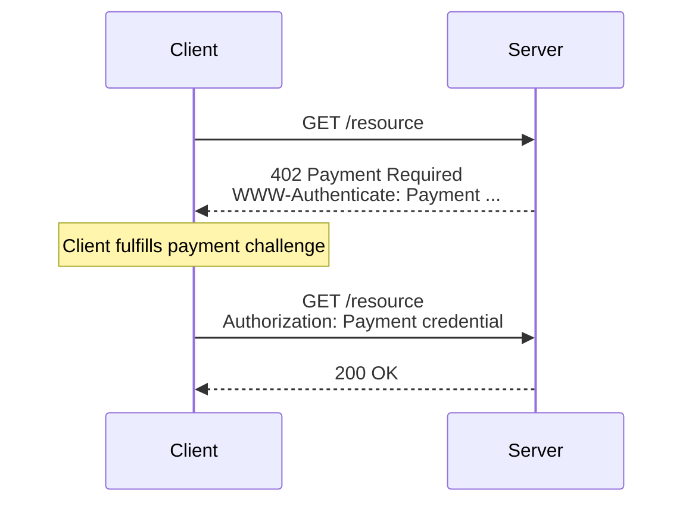

# Machine Payments Protocol (MPP)

The documentation site, service directory, and developer portal for the Machine Payments Protocol.

* **[mpp.dev](https://mpp.dev)** — live site
* **[IETF Specs](https://tempoxyz.github.io/mpp-specs/)** — the core specification submitted to the IETF
* **[Service Directory](https://mpp.dev/services)** — browse MPP-enabled services

## Overview

MPP lets any client—agents, apps, or humans—pay for any service, inline, over HTTP. This repository contains:

- **Documentation** — quickstart guides, protocol explainers, and SDK references for [TypeScript](https://github.com/wevm/mppx), [Python](https://github.com/tempoxyz/pympp), and [Rust](https://github.com/tempoxyz/mpp-rs)
- **Service Directory** — a registry of MPP-enabled services with pricing, endpoints, and payment methods
- **Landing page** — the public-facing site at [mpp.dev](https://mpp.dev)
- **API routes** — demo endpoints for the interactive terminal and search



## Development

```bash
pnpm install      # Install dependencies
pnpm run dev      # Start development server
pnpm run build    # Production build
pnpm run preview  # Preview production build
```

### Prerequisites

- **Node.js** >= 24
- **pnpm** >= 10

### Useful commands

| Command | Description |
|---------|-------------|
| `pnpm dev` | Local development server |
| `pnpm build` | Production build |
| `pnpm check` | Biome lint and format |
| `pnpm check:types` | TypeScript type checking |
| `pnpm test` | Run unit tests |
| `pnpm test:e2e` | Run end-to-end tests |

## Project structure

```
src/
  pages/           — file-based routing (.mdx, .tsx)
    _api/          — API routes (server-side handlers)
    guides/        — how-to guides
    intents/       — payment intent docs
    payment-methods/ — payment method docs
    protocol/      — protocol concept docs
    quickstart/    — getting started guides
    sdk/           — SDK reference (TypeScript, Python, Rust)
  components/      — React components
  data/            — runtime data loaders
  public/          — static assets
schemas/
  services.ts      — service registry (source of truth)
  discovery.json   — generated discovery file
  discovery.schema.json — JSON Schema for service entries
scripts/           — build and codegen scripts
vocs.config.ts     — Vocs site configuration
```

## Contributing to the service directory

The service directory at [mpp.dev/services](https://mpp.dev/services) lists all MPP-enabled services. To add or update a service, edit the registry source file and open a pull request.

### Add a new service

1. **Edit `schemas/services.ts`** — add a new entry to the `services` array:

```ts
{
  id: "my-service",                              // URL-safe unique ID
  name: "My Service",                            // Display name
  url: "https://api.example.com",                // Upstream provider URL
  serviceUrl: "https://my-service.mpp.tempo.xyz",// MPP service URL
  description: "What your service does.",
  categories: ["ai"],                            // One or more: ai, blockchain, compute, data, media, search, social, storage, web
  integration: "first-party",                    // "first-party" or "third-party"
  tags: ["llm", "chat"],                         // Freeform search tags
  docs: {
    homepage: "https://docs.example.com",
    llmsTxt: "https://docs.example.com/llms.txt",
  },
  provider: { name: "Example Inc.", url: "https://example.com" },
  realm: MPP_REALM,
  intent: "charge",                              // Default intent: "charge" or "session"
  payment: TEMPO_PAYMENT,                        // Use TEMPO_PAYMENT for Tempo USDC
  endpoints: [
    { route: "POST /v1/completions", desc: "Generate completions", amount: "5000" },
    { route: "GET /v1/models", desc: "List models" },  // Omit amount for free endpoints
  ],
}
```

2. **Regenerate the discovery file**:

```bash
node scripts/generate-discovery.ts
```

3. **Validate** — the build runs schema validation automatically:

```bash
pnpm check:types
pnpm build
```

4. **Open a pull request** with both `schemas/services.ts` and `schemas/discovery.json` changes.

### Service schema

Each service entry requires:

| Field | Type | Description |
|-------|------|-------------|
| `id` | `string` | URL-safe unique identifier (`^[a-z0-9-]+$`) |
| `name` | `string` | Human-readable display name |
| `serviceUrl` | `string` | MPP service URL |
| `endpoints` | `EndpointDef[]` | List of API endpoints with pricing |
| `intent` | `"charge" \| "session"` | Default payment intent |
| `payment` | `PaymentDefaults` | Payment method, currency, and decimals |

See [`schemas/discovery.schema.json`](schemas/discovery.schema.json) for the full JSON Schema.

### Endpoint pricing

Prices are specified in **base units** of the currency. For USDC (6 decimals):

| Amount | Human-readable |
|--------|---------------|
| `"1000"` | $0.001 |
| `"5000"` | $0.005 |
| `"100000"` | $0.10 |
| `"1000000"` | $1.00 |

Set `dynamic: true` for endpoints where pricing varies by request (for example, per-token LLM pricing).

## Contributing

We welcome contributions to documentation, the service directory, and site improvements.

### Pull request checklist

1. **Types pass**: `pnpm check:types`
2. **Build succeeds**: `pnpm build`
3. **Lint passes**: `pnpm check`
4. **E2E tests pass** (if touching terminal or interactive components): `pnpm test:e2e`

### Types of changes

| Change type | Process |
|-------------|---------|
| Typo or editorial fix | Direct PR to `main` |
| New documentation page | Follow existing page structure in `src/pages/` |
| New service listing | Edit `schemas/services.ts`, regenerate, PR |
| Service update | Edit the service entry in `schemas/services.ts`, regenerate, PR |
| New component | Follow patterns in `src/components/` |
| Site configuration | Open an issue first for discussion |

## Related repositories

| Repository | Description |
|------------|-------------|
| [tempoxyz/mpp-specs](https://github.com/tempoxyz/mpp-specs) | IETF specifications |
| [wevm/mppx](https://github.com/wevm/mppx) | TypeScript SDK |
| [tempoxyz/pympp](https://github.com/tempoxyz/pympp) | Python SDK |
| [tempoxyz/mpp-rs](https://github.com/tempoxyz/mpp-rs) | Rust SDK |

## License

Documentation content: [CC0 1.0 Universal](https://creativecommons.org/publicdomain/zero/1.0/) (Public Domain)

Code and tooling: [Apache 2.0](LICENSE-APACHE) or [MIT](LICENSE-MIT), at your option
