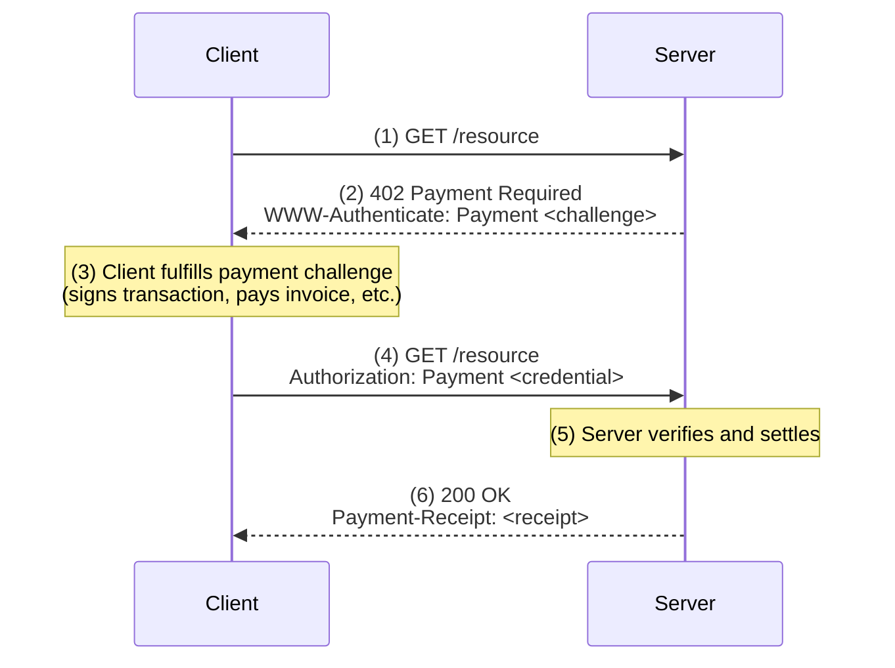

import { Card, Cards } from 'vocs'

# Machine Payments Protocol

The **Machine Payments Protocol (MPP)** is an internet-native payments protocol for machine-to-machine transactions. 

You can learn more about the protocol itself at https://machinepaymentsprotocol.com

:::tip[Get started in 5 minutes]
Check out the [Quickstart](/quickstart) to build your first payment-enabled API.
:::

## Principles

| Principle | Description |
|---------|-------------|
| **True web standards** | Built on an IETF-track specification using open protocol, not a proprietary protocol or payment method specific ecosystem.  |
| **Multi-rail** | Crypto, cards, bank transfers—all through one protocol |
| **Currency agnostic** | No implicit advantages at the protocol layer for any currency or asset. |
| **Designed for payments** | Idempotency, security, and receipts as first-class primitives |
| **Simple, extensible core** | Minimal protocol designed for extension |

## Flow

## Use Cases

### APIs
Programmatic APIs can enable true pay-per-use pricing without requiring upfront API keys or billing accounts. Clients, including agents, can authenticate and pay inline -- no manual signup or plumbing required.

### MCP Servers

Tools served via the Model Context Protocol (MCP) can monetize without the complexities of OAuth integrations and account models. MPP's MCP transport lets agents pay for tool calls autonomously.

### Content Providers
Publishers can monetize individual articles or data queries without forcing users through subscription paywalls—or gate content from known AI scrapers with micro-payment requirements.

## SDKs

MPP currently ships official SDKs in TypeScript, Python, and Rust.

| Language | Package | GitHub | Status |
|----------|---------|--------|--------|
| [TypeScript](/sdk/typescript) | [`mpay`](https://www.npmjs.com/package/mpay) | [wevm/mpay](https://github.com/wevm/mpay) | Reference |
| [Python](/sdk/python) | [`pympay`](https://pypi.org/project/pympay/) | [tempoxyz/pympay](https://github.com/tempoxyz/pympay) | Beta |
| [Rust](/sdk/rust) | [`mpay`](https://crates.io/crates/mpay) | [tempoxyz/mpay-rs](https://github.com/tempoxyz/mpay-rs) | Beta |

## Next Steps

<Cards>
  <Card
    description="Accept or make your first payment in 5 minutes with a simple full-stack example"
    icon="lucide:rocket"
    title="Quickstart"
    to="/quickstart"
  />
  <Card
    description="Understand concepts like challenges, credentials, and receipts"
    icon="lucide:book-open"
    title="Learn the Protocol"
    to="/protocol"
  />
  <Card
    description="Normative IETF-style spec"
    icon="lucide:file-text"
    title="Read the Specification"
    to="https://paymentauth.tempo.xyz"
  />
</Cards>
