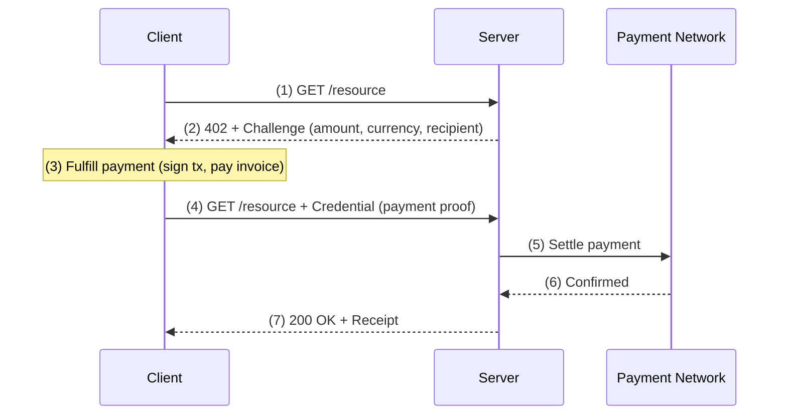

import { Badge, Card, Cards } from 'vocs'
import { SpecCard } from '../../components/SpecCard'

# Charge [Immediate one-time payments]

The `charge` intent requests an immediate one-time payment. The client pays a fixed amount and the server settles the transaction before returning the response. This is the simplest MPP payment pattern—one request, one payment, one receipt.

## How it works

1. Client requests a paid resource
2. Server responds with `402` and a Challenge specifying the payment requirements—`amount`, `currency`, and `recipient`
3. Client fulfills the payment using the method specified in the Challenge
4. Client retries the request with the payment proof as a Credential
5. Server verifies the Credential and settles the payment on the underlying network
6. Payment confirms on the network
7. Server returns the resource with a Receipt

## When to use charge

Charge is the right intent when each request maps to a single payment with a known cost:

- **Paid API endpoints**—Charge per request for data, compute, or content
- **Content access**—Pay-per-article, pay-per-query, or pay-per-download
- **Tool calls**—MCP tool invocations where each call has a fixed price
- **Simple integrations**—No channel setup, no state management, no storage backend

For metered or usage-based billing where the total cost isn't known upfront, use the session intent instead.

## Request schema

The charge intent defines the following request fields:

| Field | Type | Required | Description |
|---|---|---|---|
| `amount` | string | Required | Payment amount in base units |
| `currency` | string | Required | Currency identifier (token address, currency code) |
| `description` | string | Optional | Human-readable description of the payment |
| `expires` | string | Optional | ISO 8601 expiry timestamp |
| `externalId` | string | Optional | Server-defined idempotency key |
| `recipient` | string | Optional | Recipient identifier (address, account ID) |

Payment methods extend this schema with method-specific fields through `methodDetails`. For example, Tempo adds `chainId` and `feePayer`.

## Method integrations

Each payment method defines how charge is fulfilled, verified, and settled on its underlying network.

<Cards>
  <Card
    icon='<svg viewBox="0 0 24 24"><path fill="currentColor" d="M10.55 17h-2.73l2.53-7.73h-3.24l.71-2.27h9.03l-.71 2.27h-3.07L10.55 17Z"/></svg>'
    title="Tempo"
    description="One-time TIP-20 token transfers with ~500ms finality and optional fee sponsorship"
    to="/payment-methods/tempo/charge"
  />
  <Card
    topRight={<Badge variant="warning">Coming soon</Badge>}
    icon="simple-icons:stripe"
    title="Stripe"
    description="One-time card or bank payment"
    to="/payment-methods/stripe"
  />
</Cards>

## Specification

<Cards>
  <SpecCard to="https://tempoxyz.github.io/mpp-specs/draft-payment-intent-charge-00" />
</Cards>
