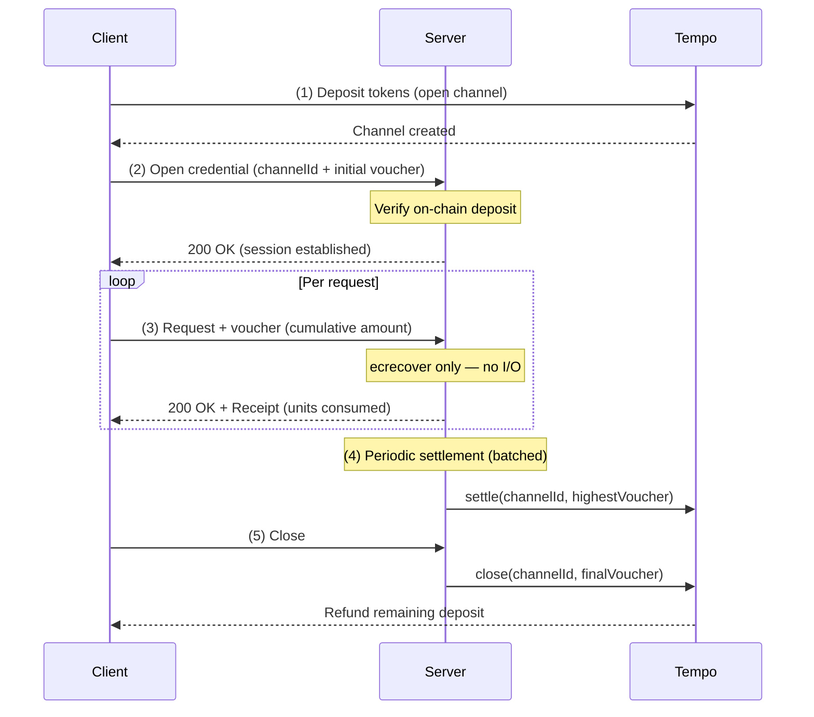

import { Cards, Tab, Tabs } from 'vocs'
import { SpecCard } from '../../../components/SpecCard'

# Stream [Low-cost high-throughput payments]

The `stream` intent enables high-frequency, pay-as-you-go payments over unidirectional payment channels. Clients deposit funds into an on-chain escrow and sign off-chain vouchers as they consume resources. The server verifies vouchers with pure CPU-bound signature checks—no I/O, no on-chain calls, no latency—and settles periodically in batches.

Streaming payments reduce payment verification to near constant time, making it possible to meter and bill at the granularity of individual LLM tokens, API calls, or bytes transferred.

## Why streaming matters in MPP

Traditional payment rails target human purchase flows: a buyer decides, pays, and receives goods. Usage-based billing—the model that powers cloud infrastructure, LLM APIs, and metered services—requires something fundamentally different. It needs payment verification that can keep pace with the service itself.

Consider an LLM API: a single inference request can generate hundreds of tokens over several seconds. Each token has a known cost. The total cost isn't known when the request begins. Card-based billing handles this by accumulating usage and charging after the fact, introducing credit risk, reconciliation complexity, and billing disputes. Prepaid credit systems require the client to guess consumption upfront and lose unused funds.

MPP Streams on Tempo solve this by making payment a continuous, inline part of the HTTP request. The client signs a cumulative voucher for each increment of service consumed, and the server verifies it in microseconds. No network round-trips. No database writes. No settlement latency in the hot path. The server delays on-chain settlement to whenever it chooses—batching hundreds or thousands of vouchers into a single on-chain transaction.

## How it works

### Overview



A stream payment has four phases:

### 1. Open

The client deposits funds into an on-chain escrow contract, creating a payment channel between the client (payer) and server (payee). A unique `channelId` identifies the channel and holds the deposited TIP-20 tokens.

### 2. Stream

The client signs EIP-712 vouchers with increasing cumulative amounts as service is consumed. Each voucher authorizes "I have now consumed up to X total." The server verifies the signature, checks that the cumulative amount is higher than the previous voucher, and grants access based on the delta.

Voucher verification is CPU-bound: a single `ecrecover` call against the EIP-712 typed data. No RPC calls. No database lookups in the critical path. This is what enables per-token LLM billing without adding network latency.

### 3. Top up

If the channel runs low on funds, the client deposits additional tokens without closing the channel. The session continues uninterrupted.

### 4. Close

Either party can close the channel. The server calls `close()` on the escrow contract with the highest voucher, settling the final balance on-chain and refunding any unused deposit to the client.

## High volume API billing

Streaming payments match the billing model that high-volume APIs need: pay stablecoin tokens, receive API responses. The granularity of payment matches the granularity of consumption.

A typical flow for a high-volume LLM API:

1. Client opens a channel with a 10 USDC deposit
2. Client sends a prompt to the LLM API
3. As the model generates tokens, the server issues Challenges requesting payment for each chunk (for example, 0.000025 USDC per token)
4. The client signs a voucher for each chunk—the cumulative amount increases by the cost of tokens received
5. The server verifies the voucher signature (~microseconds) and streams the next chunk
6. After the session, the server settles on-chain and the client gets the unused deposit back

The server never touches the chain during inference. Payment verification adds microseconds of CPU overhead per chunk, not hundreds of milliseconds of network latency. 

:::info[Why Tempo]
Tempo handles payments at scale and has properties that make it a uniquely good fit for streaming payments:

- **Channel management UX**—Opening, topping up, and closing channels are on-chain operations. Tempo's ~500ms finality and sub-cent fees keep channel lifecycle from becoming a UX bottleneck.
- **Payment lane**—Tempo's 2D nonce system provides dedicated nonce lanes for payment transactions, so channel operations don't block other account activity. This matters for clients that use the same account for payments and other on-chain interactions.
- **High throughput**—When a server settles thousands of channels, Tempo's throughput handles the settlement volume without congestion or fee spikes.
- **Fee sponsorship**—Servers can pay channel management fees on behalf of clients, making the client-side integration purely off-chain after the initial deposit.
- **Enshrined tokens**—TIP-20 tokens are precompile-based, not smart contracts. Token operations are cheaper and more predictable than ERC-20 interactions on other chains.
:::

## Integration

<Tabs stateKey="platform">
  <Tab title="Server">
  <div className="space-y-4">

Use [`tempo.stream`](/sdk/typescript/server/Method.tempo.stream) to accept streaming payments. The server needs an RPC URL for on-chain verification during channel open/close, and a storage backend for channel state.

```ts twoslash
import { Mpay, tempo } from 'mpay/server'

declare const storage: tempo.ChannelStorage

const mpay = Mpay.create({
  methods: [
    tempo.stream({
      currency: '0x20c0000000000000000000000000000000000000',
      recipient: '0xa726a1CD723409074DF9108A2187cfA19899aCF8',
      storage,
    }),
  ],
})
```

During streaming, the server verifies each voucher with a single `ecrecover`—no RPC calls, no database writes in the hot path. On-chain interaction only happens during open, settlement, and close.

Use `mpay.stream` in your request handler to meter access:

```ts twoslash
import { Mpay, tempo } from 'mpay/server'

declare const storage: tempo.ChannelStorage

const mpay = Mpay.create({
  methods: [
    tempo.stream({
      currency: '0x20c0000000000000000000000000000000000000',
      recipient: '0xa726a1CD723409074DF9108A2187cfA19899aCF8',
      storage,
    }),
  ],
})
// ---cut---
export async function handler(request: Request) {
  const result = await mpay.stream({
    amount: '25',
    currency: '0x20c0000000000000000000000000000000000000',
    recipient: '0xa726a1CD723409074DF9108A2187cfA19899aCF8',
    unitType: 'llm_token',
  })(request)

  if (result.status === 402) return result.challenge

  return result.withReceipt(Response.json({ data: '...' }))
}
```

### With multiple methods

Register multiple methods to accept multiple payment methods on the same server. 

For example, to accept both charge and stream payments:

```ts twoslash
import { Mpay, tempo } from 'mpay/server'

declare const storage: tempo.ChannelStorage

const mpay = Mpay.create({
  methods: [
    tempo.charge(),
    tempo.stream({
      storage,
    }),
  ],
})
```

:::info
See [`tempo.stream` server reference](/sdk/typescript/server/Method.tempo.stream) for the full parameter list.
:::

  </div>
  </Tab>
  <Tab title="Client">
  <div className="space-y-4">

Use [`tempo.stream`](/sdk/typescript/client/Method.tempo.stream) with `Mpay.create` to sign vouchers automatically when the server requests streaming payments.

```ts twoslash
import { Mpay, tempo } from 'mpay/client'
import { privateKeyToAccount } from 'viem/accounts'

const account = privateKeyToAccount('0xabc…123')

Mpay.create({
  methods: [tempo.stream({ account })],
})

const response = await fetch('https://api.example.com/v1/chat/completions')
// Automatically opens channel, signs vouchers per chunk
```

### Without polyfill

If you don't want to patch `globalThis.fetch`, use `mpay.fetch` directly:

```ts twoslash
import { Mpay, tempo } from 'mpay/client'
import { privateKeyToAccount } from 'viem/accounts'

const account = privateKeyToAccount('0xabc…123')

const mpay = Mpay.create({
  polyfill: false,
  methods: [tempo.stream({ account })],
})

const response = await mpay.fetch('https://api.example.com/v1/chat/completions')
```

### With multiple methods

Register multiple methods so the client can handle servers that offer multiple payment methods. 

For example, to accept both charge and stream payments:

```ts twoslash
import { Mpay, tempo } from 'mpay/client'
import { privateKeyToAccount } from 'viem/accounts'

const account = privateKeyToAccount('0xabc…123')

Mpay.create({
  methods: [
    tempo.charge({ account }),
    tempo.stream({ account }),
  ],
})
```

:::info
See [`tempo.stream` client reference](/sdk/typescript/client/Method.tempo.stream) for the full parameter list.
:::

  </div>
  </Tab>
</Tabs>

## Specification

<Cards>
  <SpecCard to="/specs/draft-tempo-stream-00" />
</Cards>
