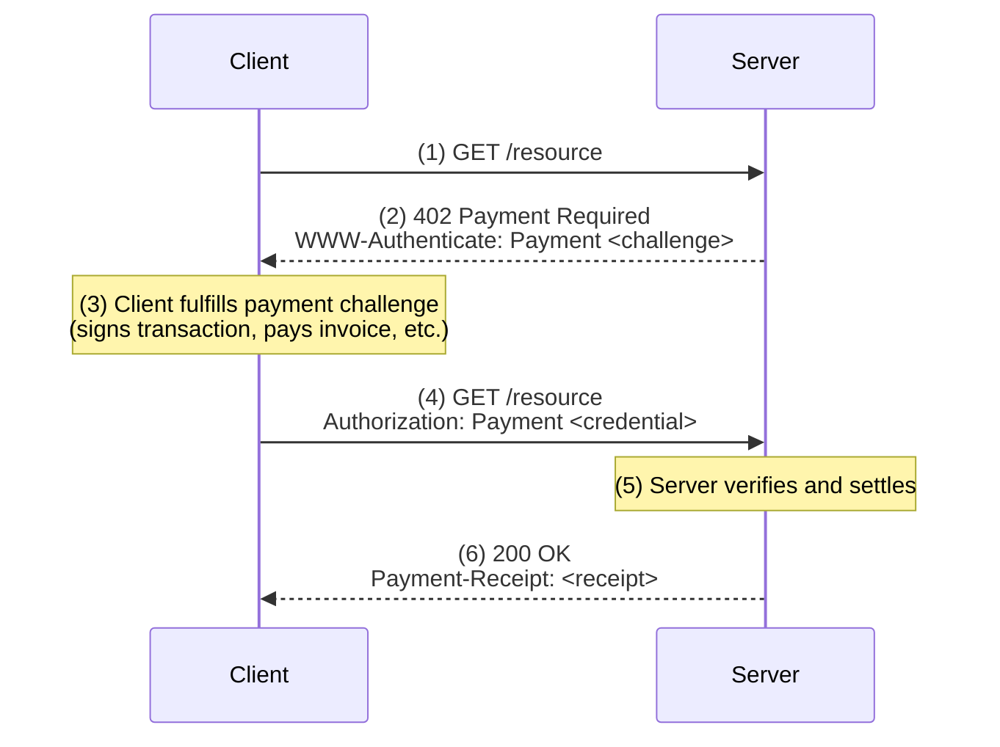

# Protocol Overview

The Machine Payments Protocol (MPP) is an internet-native protocol for machine-to-machine payments. It standardizes HTTP 402 "Payment Required" with a simple, extensible framework that works with any payment network.

This section provides a developer-friendly overview. For the normative specification, see [paymentauth.tempo.xyz](https://paymentauth.tempo.xyz).

## The Flow

1. Client requests a resource
2. Server responds with 402 and a **challenge** describing the payment required
3. Client fulfills the challenge (signs a transaction, pays an invoice, etc.)
4. Client retries with a **credential** proving payment
5. Server verifies payment and returns the resource with a **receipt**

## Core Concepts

| Concept | Description |
|---------|-------------|
| [HTTP 402](/protocol/http-402) | The status code that signals payment is required |
| [Challenges](/protocol/challenges) | Server-issued payment requirements in `WWW-Authenticate` |
| [Credentials](/protocol/credentials) | Client-submitted payment proofs in `Authorization` |
| [Receipts](/protocol/receipts) | Server acknowledgment of successful payment |
| [Transports](/protocol/transports) | HTTP and MCP transport bindings |

## Payment Method Agnostic

MPP is designed to work with any payment network or currency. The core protocol defines the framework, while **payment methods** define how specific networks integrate:

| Method | Description | Status |
|--------|-------------|--------|
| [Tempo](/payment-methods/tempo) | Native stablecoin payments on Tempo Network | Production |
| Stripe | Traditional card and bank payments via Stripe | Planned |
| Lightning | Bitcoin Lightning Network invoices | Planned |

Each payment method specifies its own `request` and `payload` schemas while sharing the common challenge/credential flow.

:::info[Extensible by design]
Anyone can define new payment methods. The protocol only requires that methods define their `request` schema (what the server asks for) and `payload` schema (what the client provides as proof).
:::

## Full Specification

These docs provide a practical overview. For normative, IETF-style specifications:

:::note[IETF-Track Specifications]
- [Payment HTTP Authentication Scheme](https://paymentauth.tempo.xyz/core/payment-auth) – Core protocol spec
- [Payment Methods](https://paymentauth.tempo.xyz/methods) – Payment method definitions
- [Payment Intents](https://paymentauth.tempo.xyz/intents) – Intent types (charge, authorize, subscription)
- [MCP Transport](https://paymentauth.tempo.xyz/transports/mcp) – Model Context Protocol binding
:::
