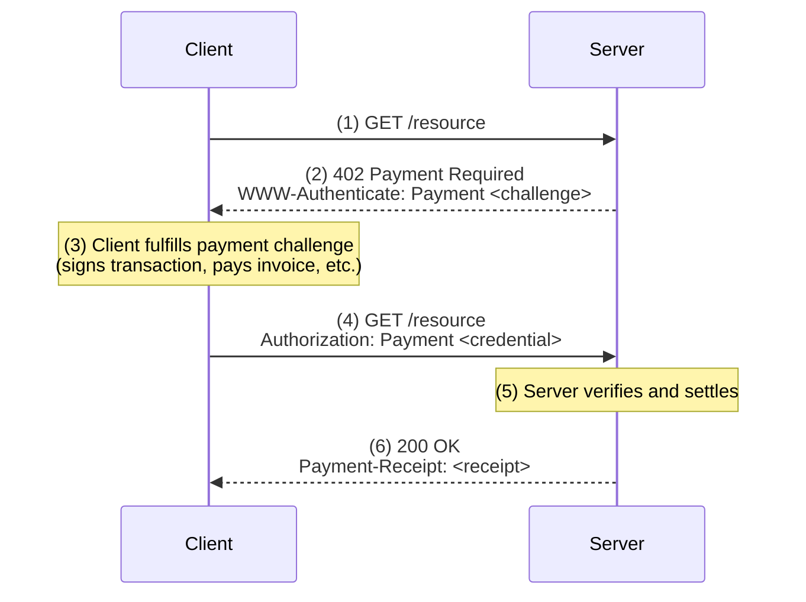

# Quickstart

Build machine-to-machine payments in minutes using the MPP TypeScript SDK.

## How it works

MPP uses HTTP 402 (Payment Required) to negotiate payments between clients and servers:

1. **Client** requests a protected resource
2. **Server** responds with `402` and a payment challenge in `WWW-Authenticate`
3. **Client** fulfills the payment and retries with a credential in `Authorization`
4. **Server** verifies payment and returns the resource with a receipt



## Installation

:::code-group

```bash [npm]
npm install mpay viem
```

```bash [pnpm]
pnpm add mpay viem
```

```bash [bun]
bun add mpay viem
```

:::

## Next steps

- [**Client Quickstart**](/quickstart/client) — Pay for resources, handle 402 responses
- [**Server Quickstart**](/quickstart/server) — Charge for resources, verify payments
